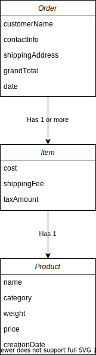

Order Filter
-----

This project is a `Scala` application to filter and group orders made at an ecommerce platform and check if old products are being sold.

### Getting Started

#### Running locally

Make sure you have the proper tools installed. This project is using:

- `sbt` version `1.4.6`
- `java` version `1.8`
- `scala` version `2.13.4` 

1. Package the source into a `.jar` file. This will create the file `target/scala-2.13/order-filter_2.13-0.1.jar`.
    ```shell script
    sbt package 
    ```
   
2. The unit tests can be run by executing the following command.
    ```shell script
    sbt test
    ```

3. Run the compiled application.
    ```shell script
    scala target/scala-2.13/order-filter_2.13-0.1.jar
    ```

#### Running in a docker container

Alternatively, you can use the `Dockerfile` provided. It has all the necessary dependencies and can be used as is to run the application. To do that, `cd` into the cloned repository folder and execute the following commands:

```shell script
docker build -t order-filter .
docker run --rm order-filter "2019-01-01T00:00:00.000-00:00,2021-01-01T00:00:00.000-00:00"
```

```shell script
Running orderStats filtering between 2019-01-01T00:00Z and 2021-01-01T00:00Z with bins List((1,3), (4,6), (7,12)) and threshold 12
Products with >12 months have been ordered 3 times
Products with 7-12 months have been ordered 2 times
Products with 1-3 months have been ordered 1 times
Products with 4-6 months have been ordered 3 times
```

### Functionality

The project uses a sample data to mock a list of orders and products. This data can be changed if needed in the file [SampleData.scala](./src/main/scala/com/orders/SampleData.scala).

The application receives 2 parameters: 
1. Dates with timezone to filter the orders. This parameter is mandatory and has the format `"<DATE1>,<DATE2>"`, for example `"2019-01-01T00:00:00.000-00:00,2021-01-01T00:00:00.000-00:00"`. 
2. Bins to group the product creation dates in months. This parameter is optional and has the format `"[<MIN>-<MAX>],<THRESHOLD>"`, for example `"1-2,3-7,7"`. If no value is provided, the default value used will be `"1-3,4-6,7-12,12"`.

### Model

The following ERD represents the order model. There are three entities: 
1. `Product` represents a single object that is available for purchase.
2. `Item` represents a product after it has been added to the cart.
3. `Order` represents one or more items that have been selected and purchased by a customer.  

